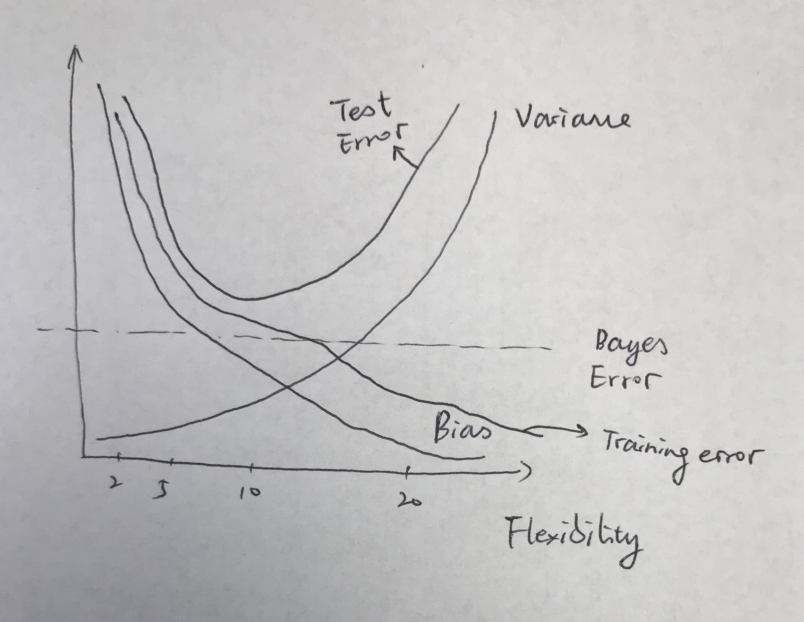

### Exercise 1
**#1.**

**(a) The sample size n is extremely large, and the number of predictors p is small.**

Better. The flexible method is better with a larger sample size.

**(b) The number of predictors p is extremely large, and the number of observations n is small.**

Worse. The flexible method is prone to be overfitting. Therefore, it is better to use unflexible method here.

**(c) The relationship between the predictors and response is highly non-linear. **

Better. The inflexible method will have a higher bias for non-linear relationship than the flexible one.

**(d) The variance of the error terms, i.e. σ2 = Var(ε), is extremely high.**

Worse. The flexible method would intend to fit the error and will have a higher variance.


**#2.**

**(a) We collect a set of data on the top 500 firms in the US. For each firm we record profit, number of employees, industry and the CEO salary. We are interested in understanding which factors affect CEO salary.**

Regression. Inference. n = 500. p = 3.

The CEO salary is quantitative, therefore this intends to be a regression problem. Since we are going to analyze the relationship between factors and salary, we are more interested in inference. 

**(b) We are considering launching a new product and wish to know whether it will be a success or a failure. We collect data on 20 similar products that were previously launched. For each product we have recorded whether it was a success or failure, price charged for the product, marketing budget, competition price, and ten other variables.**

Classification. Prediction. n = 20. p = 13.

Whether it was a sucess or failure is qualititative, so this is a classification problem. And we are going to predict the success of a new product, therefore we are more interested in prediction.

**(c) We are interested in predicting the % change in the USD/Euro exchange rate in relation to the weekly changes in the world stock markets. Hence we collect weekly data for all of 2012. For each week we record the % change in the USD/Euro, the % change in the US market, the % change in the British market, and the % change in the German market.**

Regression. Prediction. n = 52. p = 3.

% change is quantitative, thus this is a regression problem. Since we are going to predict the % change, we are more interested in prediction.

**#3. **

**(a)**
image: 

**(b)**

(i) Bias is decreasing because the method should be better fit with higher flexibility.

(ii) Variance is increasing because higher flexibility prones to overfitting, which means the method is less able to adapt to a different dataset.

(iii) Training error tends to decrease since the flexible method will fit better, thus reducing the training error.

(iv) Test error will decrease at first and start increasing at a certain point. Because at the beginning, with the increasing in flexibility, the model is better fit for the dataset and help test error going down. While much higher flexibility prones to overfitting, which means it cannot predict correctly on the new data and cause increasing test error.

(v) Bayes error is irreducible, which equals to the lowest achievable test MSE among all possible methods. Expected test MSE can never lie below bayes error. 

**#4. **

**(a)**

(i) Predicting whether it is going to rain tomorrow or not. Predictors: The history of rainning at the same time period in last 5 years, climate, soil and vegetation. Prediction.

(ii) Predicting whether a basketball team is going to win in the next game. Predictors: The history of such team's performance, the history performance of opponent and the location of the game.Prediction.

(iii) Determining what factors impact one's blood type. Predictors: Parents and grandparents' blook types, the food that mother consumed during pregnancy and the drug that mother has taken during pregnancy. Inference.

**(b)**

(i) Predicting the school enrollment in the coming year. Predictors: The school enrollment in last 10 years, the number of applicants in last 10 years and the enrollment of school in the same tier. Prediction.

(ii) Analyzing the factors that impact the electricity consumption in an area. Predictors: The number of households in that area, the number of factories in that area and the number of infrastructures in that area. Inference.

(iii) Predicting the GDP of US in the coming year. Predictors: Wages, corporate profits and interest. Prediction.

**(c)**

(i) Grouping the hotels in New York City to make recommendation.
(ii) Grouping the students in a school to improve the teaching method.
(iii) Grouping the users based on users' behavior to differentiate advertisement.

**#5. **

Advantages: A very flexible approach is closer fit to the dataset and has a lower bias.

Disadvantages: A very flexible approach prones to be overfitting with higher variance and is hard to interprete.

A very flexible approach is preferred for prediction and dataset with many variables.While a less flexible approach is preferred for inference and a linear dataset.


**#6. **

Parametric approach makes an assumption about the function form at first, while non-parametric does not. 

Advantages: It simplifies the problem because it is much easier to estimate the parameters then the function form.

Disadvantages: The model will usually not match the true unknown form and prone to be overfitting if we choose flexible approach.

**#7.**

**(a)**

Obs.1 = 3
Obs.2 = 2
Obs.3 = 3.16
Obs.4 = 2.24
Obs.5 = 1.41
Obs.6 = 1.73

**(b)**

Y is green. Because we predict the Y with only 1 nearest neighbor. Obs.5 is the closest one and its Y is green. 

**(c)**

Y is red. Because we predict the Y based on 3 nearest neighbors in this case: Obs.2, Obs.5 and Obs.6. Two of them is red, therefore Y is red.

**(d)**

The best value for K should be small. The boundary with small K would be more flexible and fit better.

**8.**

**(a)**

```{r}
college <- read.csv('College.csv')
```

**(b)** ??????????? Fix does not works

```{r}
rownames(college) <- college[,1]
```
View(college)

**(c)**

(i) 

```{r}
summary(college)
```
(ii) 

```{r}
pairs(college[,1:10])
```

(iii) 

```{r}
attach(college)
plot(Outstate, Private)
```

(iv)
```{r}
Elite=rep("No",nrow(college))
Elite[college$Top10perc >50]="Yes"
Elite=as.factor(Elite)
college=data.frame(college ,Elite)
summary(Elite)
plot(Outstate, Elite)
```

(v)
```{r}
par(mfrow=c(2,2))
hist(Apps)
hist(Accept)
hist(Enroll)
hist(Top10perc)
```

(vi)
```{r}
library(tidyverse)
by_elite <- group_by(college, Elite)
accpet_means <- summarise(by_elite, acceptRate = mean(Accept/Apps), enrollRate = mean(Enroll/Accept))
```
